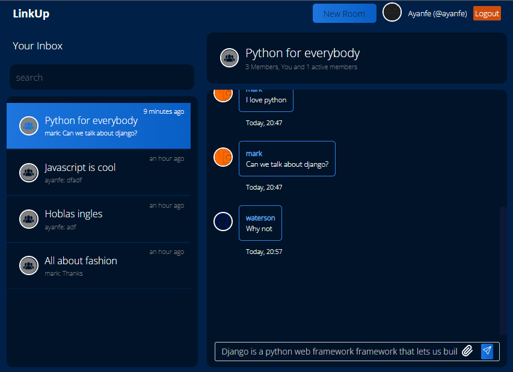

# Linkup

**_Chat application with real time communication with support for storing messages in database_**

    

A django channels powered chat application that supporting creating editing and deleting chatroom, user authentication, uploading and editing profile pictures.

## Tools

-   Python - django, django rest framework, django channels

-   Javascript - web sockets

-   Html and Css

## Running Project Locally

-   Clone this repository

-   Install requirements file by running `pip install -r requirements.txt`
-   Run migrations with the command `python manage.py makemigrations`
-   You can now start the server with `python manage.py runserver`

## Demo Images

    
    
    
    

